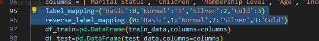

# Classification

> python my_classifier.py

>github網址:https://github.com/shangyuan191/Classification
## Data Preprocessing
* #### Missing Value Imputation
在讀檔時先將每筆資料的缺失欄位填上"Unknown"，然後在資料前處理的時候對不同的欄位進行不同的缺失值處理
1. 會員卡的欄位若遇到Unknown則填入"Basic"
2. 發現婚姻狀態只有M與Unknown，因此可以在待會的one hot encoding處理
3. 小孩數量、年齡、收入這三個欄位的Unknown則搭配該欄位非缺失值的分布，生成同樣比例的假值並填入，例如小孩數量欄位的非缺失值的比例分別為:
> 一個小孩:兩個小孩:三個小孩 = 2:3:2 則該欄位的缺失值的部分也按照這個比例去填入假值，以求不要破壞原有資料的分布
* #### One Hot Encoding
對婚姻狀態進行one hot encoding，分成兩個欄位:Marital_Status_M與Marital_Status_Unknown
* #### Label Encoding
將會員卡等級label的四種等級分別對應到0,1,2,3，並且設計反向mapping，以便最後輸出結果到output.csv時能將編碼轉回字串類別顯示

* #### Normalization
將小孩數量、年齡、收入三個欄位進行Normalization，mapping到0~1之間，以求不同特徵的scale差異不會影響到預測結果
## Method:KNN
使用class搭配pandas dataframe、numpy自己手刻KNN算法，以k=9的效果最好(K選擇奇數，以免發生投票平手的狀況)
## Result

Accuracy: 0.6208530805687204

Precision: 0.6528304218852999

Recall: 0.39320401820401824

F1 Score: 0.3842300138446183

Confusion Matrix:

[[113   2   0  11]

 [ 13   5   0   8]

 [ 23   1   2   7]

 [ 15   0   0  11]]

 最終預測結果在output.csv